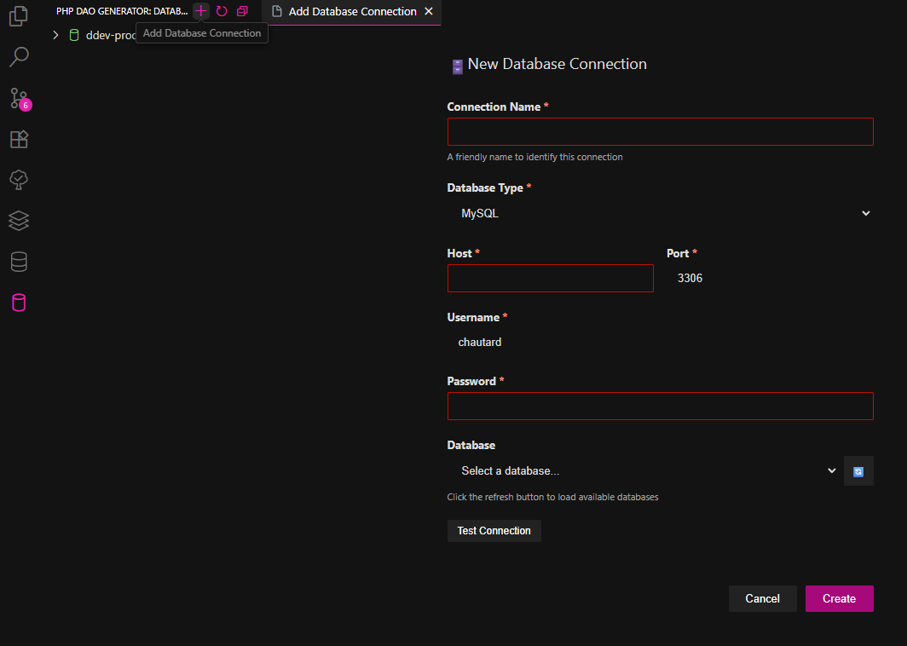
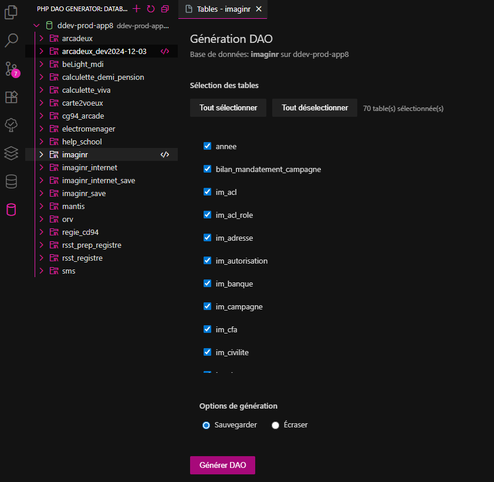

# PHP DAO Generator - Extension VSCode

Une extension Visual Studio Code permettant de **générer automatiquement des DAO (Data Access Objects) PHP** à partir de vos bases de données.  
Elle facilite la connexion à vos serveurs, l’exploration des bases, et la génération de fichiers DAO dans vos projets PHP.

---

## 🚀 Installation

<!-- 1. Téléchargez l’extension depuis la [Marketplace VSCode](https://marketplace.visualstudio.com/items?itemName=Baptiste-TABAR-LABONNE.php-dao-generator) ou installez le fichier `.vsix` manuellement :
   - Ouvrez VSCode
   - Allez dans `Extensions (Ctrl+Shift+X)`
   - Cliquez sur les `...` en haut à droite
   - Sélectionnez **Installer depuis un VSIX...**
   - Récupérez dans `S:\03-Domaine Developpement\Outils\Config Dev Poste Windows 11\Developpement\VsCode\php-dao-generator-x.x.x.vsix`

2. Une nouvelle icône **PHP DAO Generator** apparaît dans la barre latérale gauche de VSCode. -->

### Depuis la Marketplace

1. Ouvrir VS Code → `Extensions` (Ctrl+Shift+X)
2. Rechercher **PHP DAO Generator** et cliquer sur `Install`.

### Installer un `.vsix` localement

1. Se rendre sur les [releases GitHub](https://github.com/TabarBaptiste/dao-generation/releases)
2. Télécharger `VS Code Extension Package`
3. Dans VsCode aller dans `Extensions` → menu `...` → **Install from VSIX...**
4. Sélectionner le fichier `php-dao-generator-x.x.x.vsix`.

---

## 📌 Fonctionnalités principales

- Ajouter facilement des serveurs de bases de données.
- Tester la connexion avant de sauvegarder.
- Explorer vos bases et tables directement depuis la sidebar.
- Générer automatiquement des fichiers DAO pour vos tables.
- Deux modes de génération :
  - **Sauvegarder** : crée une sauvegarde dans `backup/` avant d’écraser.
  - **Écraser** : remplace directement les fichiers existants.

---

## 🖥️ Utilisation

### 1. Ouvrir l’extension
Cliquez sur l’icône **PHP DAO Generator** dans la barre latérale.

### 2. Ajouter un serveur
- Cliquez sur le bouton **+**
- Remplissez le formulaire :
  - `Connection Name *`
  - `Database Type *`
  - `Host *`
  - `Port *`
  - `Username *`
  - `Password *`
  - `Database` (liste déroulante avec bouton refresh)
- Cliquez sur **Test Connection** pour vérifier l’accès.
- Puis sur **Create**.

<!--  -->

➡️ Le serveur apparaît dans la sidebar.

### 3. Gérer un serveur
- **Connect** : affiche la liste des bases de données.
- **Edit** : permet de modifier la configuration.
- **Delete** : supprime le serveur.

### 4. Explorer une base
- Déroulez un serveur connecté
- Cliquez sur une base de données → ouvre l’onglet **Génération DAO**.

<!--  -->

### 5. Génération DAO
- Sélectionnez les tables à inclure ou exclure.
- Choisissez une option :
  - **Sauvegarder** (backup + nouveau DAO)
  - **Écraser** (remplace directement)
- Cliquez sur **Générer DAO**.

Un explorateur de fichiers s’ouvre :
- Si `D:\wamp64\www` existe, vous pouvez directement sélectionner votre projet PHP.
- Les fichiers DAO sont générés dans : `D:\wamp64\www\[projet]\local\__classes\DAO`

---

## ⚙️ Options de génération

- **Sauvegarder** :  
  - Un backup est créé dans `backup/`
  - Puis un nouveau DAO est généré

- **Écraser** :  
  - Écrase directement l’ancien fichier DAO
